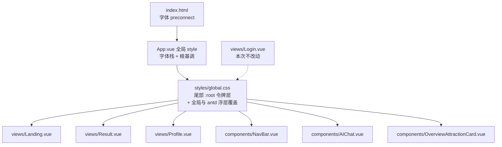

## Product Overview

TripStellar 智能旅行规划应用的前端界面视觉与布局改造。整体从当前「奶油暖调柔和卡片风」升级为「编辑式文艺杂志风」，建立米白纸感、墨黑文字、单一强调色的高级视觉体系，并统一全部页面的排版节奏。

## Core Features

- **首页（Landing）**：全屏图像刊头 + 行程表单 + 历史行程列表；大图保留但降饱和，叠加细线框、竖排刊头、期号等杂志排版元素；表单分区用大号编号 01/02/03 索引 + 发丝分隔线组织；加载流程节点与历史列表同步杂志化。
- **结果页（Result）**：行程总览卡、天气看板、预算卡、酒店卡、景点卡片流、回到顶部与空状态等区块重排，改为大留白栅格 + 发丝线分区 + 编号索引标题。
- **个人中心（Profile）**：头像信息卡与资料分组改为主编栏式排版。
- **全局导航栏（NavBar）**：顶栏、品牌字标、语言/用户胶囊、设置与扫码弹窗统一为无圆角泡泡的编辑式外观。
- **AI 助手（AIChat）**：浮动入口与对话面板收敛为纸感卡片 + 衬线标题 + 发丝线，去除毛玻璃玩具感。
- **登录页（Login）**：明确不在本次范围内，保持原样。

## Visual Effect

- 底色为暖米白纸感（主底 / 次底 / 纯白卡片），文字为近黑墨色并区分主/次/注释三级灰。
- 强调色收敛为单一深朱砂色，仅用于编号、下划线、链接与主按钮，其余一律黑白灰，对比度明显提升。
- 标题使用中英衬线字体，正文保持无衬线，编号/日期/期号使用等宽字体。
- 圆角与阴影大幅收敛，改为发丝级细线 + 极浅投影；分区之间使用 1px 细线而非粗描边卡片。
- 整体呈现大留白、强层次、克制的编辑感，接近《Kinfolk》《Monocle》的杂志气质。

## Tech Stack Selection

- 前端框架：Vue 3 + `<script setup lang="ts">` + Vite（沿用现有，不引入新框架）
- UI 组件库：ant-design-vue（沿用，仅替换皮肤色值，不迁移组件库）
- 样式：原生 CSS + 少量 SCSS（`OverviewAttractionCard.vue` 已是 scoped scss）
- 字体：Google Fonts（`Playfair Display` + `Noto Serif SC` + `Inter` + `IBM Plex Mono`），项目已有 `@import url(...)` 字体加载先例（`App.vue`、`OverviewAttractionCard.vue`）
- 新增依赖：无

## Implementation Approach

核心策略是「**追加令牌层 + 精准替换色值**」，而不是重写样式文件：

1. **建立设计令牌层**：在 `frontend/src/styles/global.css` 末尾（第 8902 行自定义区之后）追加 `:root { --ts-* }` 变量层与全局基础/antd 覆盖层。`global.css` 已在 `main.ts` 中被全局引入（且位于 `ant-design-vue/dist/reset.css` 之后），`:root` 变量对所有组件生效，因此无需改动引入顺序。
2. **不动 vendor 层**：`global.css` 前 8900 行是 Paper Kit 2 与 Nucleo 图标字体，完全不重写，只用「后置覆盖」策略调整外观，规避大范围回归风险。
3. **字体统一收口**：把字体 `@import` 集中到 `App.vue` 的全局 `<style>` 中一次性声明，移除 `OverviewAttractionCard.vue` 内冗余的 Nunito Sans / Raleway `@import`，并在 `index.html` 增加 `preconnect` / `dns-prefetch` 提升首屏字体加载表现。
4. **Hero 降饱和**：`Landing.vue` 当前把背景图通过内联 `:style="pageHeaderStyle"` 挂在 `.page-header` 上，直接加 `filter` 会连文字一起降饱和。方案是新增一个专用图层 `<div class="hero-media" :style="pageHeaderStyle"></div>` 承载背景图并施加 `filter: saturate(.45) contrast(1.06)` + 纸色蒙版，`.page-header` 自身不再绑定背景图；`.filter`、`.content-center` 的层级关系（z-index 1 / 3）保持不变，滚动视差 computed 全部复用。
5. **各文件分级替换**：`Result.vue` 体量最大（4087 行、样式区自 2940 行起），按区块（顶部导航 / 概览 / 天气 / 预算 / 酒店 / 景点 / 回到顶部 / 空状态）分段替换，不做整文件重写。
6. **antd 皮肤一致性**：现有样式大量依赖 `!important` 与 `:deep()` 覆盖 antd 默认皮肤，替换时只改颜色/圆角/描边值，保持覆盖链完整；对 `a-modal`、`a-dropdown`、`a-message`、`a-tooltip` 等 teleport 到 `body` 的浮层，在 `global.css` 全局层统一覆盖。

### 关键决策与取舍

- **为什么选追加令牌层而非逐文件换色**：硬编码色值共 300+ 处且分散在 8 个文件，先集中定义令牌再逐处替换，可避免颜色漂移，也让后续换肤只需改一处。
- **强调色选 `#B0431F`（深朱砂/陶土）而非纯红或金**：既与现有品牌橙 `#C4703F` 有血缘延续，又比其更深沉克制，符合墨黑 + 单点强调的编辑感。
- **保留外链 Hero 图片而非替换为纯色**：遵守用户「保留大图但降饱和」的选择，同时避免新增本地大体积图片资源。
- **字体联网加载的取舍**：`Noto Serif SC` 中文子集体积较大，采用 Google Fonts 的 `unicode-range` 分片 + `display=swap` + 仅取 400/600/700 三个字重，并对 `font-family` 设置完整无衬线回退链，字体未就绪时不会出现排版塌陷。

### 性能与可靠性

- 纯 CSS 改造，无 JS 逻辑变更（唯一模板改动是 Landing 的 Hero 图层 div），首屏 JS 体积零增长。
- 字体请求集中在 1 处 `@import` + 2 条 preconnect，避免多文件重复拉取同一字体族。
- 克制使用高开销属性：现有多处 `backdrop-filter` 在 Result 长列表滚动时开销较大，本次收敛为「仅顶栏与浮层保留 backdrop-filter，卡片改为不透明纸色 + 发丝边 + 极浅阴影」，降低滚动重绘成本。
- 所有改动限定在样式与视觉层，不改动数据流、接口调用与 i18n 文案。

## Architecture Design

沿用现有「全局基础层 + 页面/组件 scoped 样式层」的既有架构，不引入新的构建或样式组织模式：



分层职责：

- **令牌层（global.css `:root`）**：颜色、发丝线、圆角、阴影、字体栈、字距唯一来源。
- **全局覆盖层（global.css 尾部）**：`body`、`::selection`、滚动条、`h1-h6` 字体族、antd teleport 浮层（modal / dropdown / message / tooltip）。
- **页面/组件 scoped 层**：只负责布局、区块间距、组件专属排版，颜色一律引用 `var(--ts-*)`。

## Directory Structure

```
TripStar/frontend/
├── index.html                                    # [MODIFY] 增加 fonts.googleapis.com / fonts.gstatic.com 的 preconnect 与 dns-prefetch；确认 <html> 与 body 基础字体回退。
└── src/
    ├── App.vue                                   # [MODIFY] 全局 <style>：将 @import 扩展为 Playfair Display + Noto Serif SC + Inter + IBM Plex Mono（限字重、display=swap）；#app 改为纸色底 --ts-paper + 墨色字 --ts-ink，设置「正文无衬线 / 标题衬线」字体栈与 -webkit-font-smoothing；移除旧的 Outfit 单字体依赖。
    ├── styles/
    │   └── global.css                            # [MODIFY] 仅在第 8928 行之后追加：:root 设计令牌（纸色三级、墨色三级、发丝线两级、单点强调色、圆角、阴影、字体栈、字距、栅格最大宽度）；全局基调覆盖（body 背景/前景、::selection、滚动条）；中英标题字体族；antd 全局浮层（modal / dropdown / message / tooltip / drawer / notification）与 a-empty / a-spin / a-button 通用皮肤收敛。前 8901 行 vendor 样式保持零改动。
    ├── views/
    │   ├── Landing.vue                           # [MODIFY] 模板新增 .hero-media 背景图层承载降饱和图片；hero 刊头排版（竖排品牌字、期号 meta、细线框）；.form-panel 去泡泡圆角改发丝边框；.step-head 01/02/03 大号等宽编号 + 发丝分隔线；.field-label / .interest-pill / .submit-btn / .days-chip 令牌化；.stepper-wrapper 四节点改细线编辑式；.history-section 列表改杂志目录式（编号 + 发丝线，去卡片阴影）。保留 fogEnabled、全部滚动 computed 与响应式断点。
    │   ├── Result.vue                            # [MODIFY] 自第 2940 行 <style scoped> 起分区块替换：.result-container/.lower-shade 基调；.top-switch-nav/.top-switch-menu 导航胶囊改细线分段式；.overview-card/.overview-meta 概览区；.weather-section-card/.weather-dashboard 天气看板（保留天气动画类名）；.budget-card/.budget-summary-panel 预算卡；.hotel-card；.attraction-image-wrapper/.attraction-badge；.back-top-button；.empty-state-panel。统一去圆角泡泡、去重阴影、发丝分隔、序号索引标题。
    │   └── Profile.vue                           # [MODIFY] .profile-page/.profile-bg-shade 背景；.profile-nav-actions；.profile-card / .profile-hero-card / .profile-avatar / .profile-meta 改为编辑式信息栏（发丝线分组、等宽数值、衬线姓名）。
    ├── components/
    │   ├── NavBar.vue                            # [MODIFY] .landing-navbar 顶栏（保留 backdrop-filter，改发丝下边框与纸色底）；.landing-brand 品牌字改衬线 + 大字距；.landing-nav-btn / .landing-user-btn / .lang-select-nav / .landing-cta 胶囊改细线方框或极浅填充；非 scoped 的 .landing-user-dropdown 全局块改用令牌色；设置弹窗与小红书扫码弹窗字段样式同步。
    │   ├── AIChat.vue                            # [MODIFY] .ai-chat-floating/.card/.content-card 去毛玻璃玩具感，改纸感卡片 + 发丝边；.chat-history / .chat-bot / .options / .btns-add 消息气泡改细线 + 无气泡或直角浅底；输入区与发送按钮令牌化。
    │   └── OverviewAttractionCard.vue            # [MODIFY] 移除头部 @import 的 Nunito Sans / Raleway，改用全局令牌字体；.swiper-slide / .swiper-slide-content 底板改 var(--ts-card)；关键：将 SVG 波浪 .shape-fill { fill:#ffffff } 同步改为与卡片底色一致的令牌变量，避免波浪露白边；.show-more 圆钮改细线方块 + 强调色。
    └── views/Login.vue                           # 本次不改动（用户明确排除）
```

## Key Code Structures

设计令牌层是多文件共同依赖的唯一契约，需精确定义（追加到 `global.css` 末尾）：

```css
/* ===== TripStellar 编辑式杂志令牌层 ===== */
:root {
  /* 纸面 */
  --ts-paper: #FAF8F4;      /* 主底 */
  --ts-paper-2: #F2EFE9;    /* 次底 / 分区底 */
  --ts-card: #FFFFFF;       /* 卡片 */
  /* 墨色 */
  --ts-ink: #1A1814;        /* 主标题 */
  --ts-ink-2: #4A453D;      /* 正文 */
  --ts-ink-3: #8A8377;      /* 注释 / meta */
  /* 发丝线 */
  --ts-rule: #E2DDD4;
  --ts-rule-strong: #CFC8BC;
  /* 单点强调 */
  --ts-accent: #B0431F;
  --ts-accent-deep: #8E3216;
  --ts-accent-soft: rgba(176, 67, 31, 0.10);
  /* 功能色 */
  --ts-danger: #A63A2B;
  /* 形态 */
  --ts-r-sm: 2px;
  --ts-r-md: 4px;
  --ts-r-pill: 999px;
  --ts-shadow: 0 1px 2px rgba(26, 24, 20, 0.04), 0 10px 28px -16px rgba(26, 24, 20, 0.14);
  /* 字体 */
  --ts-font-serif: 'Playfair Display', 'Noto Serif SC', Georgia, 'Songti SC', 'STSong', serif;
  --ts-font-sans: 'Inter', -apple-system, BlinkMacSystemFont, 'Segoe UI', 'PingFang SC', 'Microsoft YaHei', sans-serif;
  --ts-font-mono: 'IBM Plex Mono', ui-monospace, SFMono-Regular, Menlo, monospace;
  --ts-tracking-caps: 0.16em;
  --ts-measure: 1120px;     /* 内容最大宽度 */
}
```

## Implementation Notes

- **禁止重写 vendor 段**：`global.css` 第 1–8901 行为 Paper Kit 2 与图标字体，只在末尾追加覆盖层。
- **覆盖链不能断**：antd 组件现有皮肤依赖 `!important` + `:deep()`，替换时保持选择器结构与 `!important` 位置不变，只改值，否则会漏出 antd 默认蓝紫皮肤。
- **波浪填充色必须同步**：`OverviewAttractionCard.vue` 中 `path.shape-fill { fill }` 必须与 `--ts-card` 保持一致，否则卡片换色后 SVG 波浪会出现白边。
- **`fogEnabled` 变量不可删**：`Landing.vue` 的 `fogLowStyle` / `movingCloudsStyle` / `lowerShadeStyle` 均依赖它，NavBar 中的切换按钮虽已注释，但变量链路仍在使用。
- **Hero 图层顺序**：`.hero-media`（z-index 0）→ `.filter` 遮罩（1）→ `.hero-bottom-shade`（1）→ `.content-center`（3），保证文字始终在降饱和图层之上。
- **浮层样式走全局**：`a-modal`、`a-dropdown`、`a-message` 等被 teleport 到 `body`，其样式必须写在 `global.css` 或 `NavBar.vue` 的非 scoped `<style>` 块中。
- **响应式断点保持**：沿用现有 1080px / 991px / 520px / 400px，仅调整数值与栅格列数，不新增断点导致行为分叉。
- **中文衬线行高**：`Noto Serif SC` 中文标题需给到 1.35–1.5 行高，比当前无衬线标题更松，避免字面挤压。
- **滚动性能**：收敛 `backdrop-filter` 使用范围（仅顶栏与浮层），长列表卡片改用不透明纸色 + 发丝边框。
- **blast radius 控制**：不改动路由、接口、i18n、`Login.vue` 与 `Home.vue`（未挂载路由），视觉改动不触碰任何交互逻辑。

## 设计风格

编辑式文艺杂志风（Editorial / Modern Magazine）。以「纸、墨、单一朱砂」三色构建视觉，用大号衬线标题、等宽编号索引、发丝分隔线与大留白替代当前的圆角泡泡卡片感。整体气质克制、留白充分、层级强硬。

## 版式与栅格语言

- 内容最大宽度收敛为 1120px，两侧大留白，首页刊头区域保留全屏。
- 分区不再使用粗描边圆角卡片，改为「发丝线分隔 + 栏目标签（uppercase + 0.16em 字距）+ 大号编号（01 / 02 / 03，等宽字体，强调色）」的目录式结构。
- 关键信息（日期、天数、预算数值、期号）改用等宽字体，强化印刷品索引感。
- 圆角由 20–28px 收敛至 2–4px；阴影改为极浅投影 + 发丝边框，杜绝悬浮泡泡感。

## 页面规划

1. **首页首屏（Landing Hero）**：保留原大图并降饱和（saturate .45 + 对比微增）+ 纸色蒙版；细线框内嵌竖排品牌刊头、期号与日期 meta、超大号 Playfair Display 主标题，底部渐隐过渡到纸面。
2. **首页表单区（Landing Form）**：三个 step 以 01/02/03 等宽大号编号 + 栏目标题 + 发丝横线领起；输入控件改细线直角、聚焦时强调色下划线；兴趣选项改细线方框标签；提交按钮为满宽强调色实底、无圆角；加载流程四节点改为细线 + 等宽节点标签。
3. **首页历史区**：改为杂志目录列表，左侧等宽编号与日期、中间城市与摘要、右侧细线箭头，行间发丝线，悬停整行淡底。
4. **结果页（Result）**：顶部切换导航改为细线分段式（当前项加下划线与强调色）；概览卡为「左图右信息」编辑式排版，meta 字段用等宽 + 发丝线分隔；天气看板保留天气动画但容器改纸色卡 + 细线；预算卡改为表格化明细（等宽数值右对齐、发丝行线）；酒店卡与景点卡去圆角、图注式标题。
5. **个人中心（Profile）**：改为主编信息栏，头像方形细线框，姓名用衬线大字，资料以「标签 : 值」的等宽两列排布，分组间发丝线分隔。
6. **全局导航与 AI 助手**：顶栏为纸色半透明 + 发丝下边框；品牌字改衬线大字距；语言/用户控件与主按钮改细线方框；AI 助手浮窗由毛玻璃玩具感改为纸卡 + 发丝边 + 衬线标题，消息区去气泡改细线分隔。

## 动效与交互

- 保留现有滚动视差（Hero 渐隐、表单揭示、雾效透明度），仅调整时长曲线至更缓（cubic-bezier(0.22, 0.61, 0.36, 1)）。
- 微交互：链接与按钮下划线由 0 宽展开至 100%；卡片悬停仅做 1–2px 上浮 + 边框色加深，不做缩放。
- 焦点态统一为强调色细描边 + 极浅强调色底，兼顾键盘可达性与印刷感。

## 响应式

沿用 1080px / 991px / 520px / 400px 断点，标题使用 clamp() 缩放（如 clamp(38px, 6vw, 84px)）；多列栅格按 3 → 2 → 1 折叠；窄屏下刊头竖排元素转为横排并压缩字距；移动端保留发丝线与编号索引，仅缩小尺度。

## Agent Extensions

### SubAgent

- **code-explorer**
- Purpose: 定位 `Result.vue`（4087 行）各视觉区块在 `<style scoped>` 中的精确行号边界，并全量清点 8 个文件中残留的旧色值硬编码位置，避免大规模改写中的遗漏与误伤。
- Expected outcome: 输出「区块名 → 起止行号」清单与「旧色值 → 新令牌」替换映射表，作为分段改造的依据。

### Skill

- **playwright-cli**
- Purpose: 在改造前对 Landing / Result / Profile 页面截图存档，改造后再次截图逐页比对，验证杂志化排版在真实渲染下的落地效果与未回归。
- Expected outcome: 生成改造前后的页面截图对照，确认 Hero 降饱和、字体加载、发丝线与响应式断点（1440 / 1024 / 768 / 375）均符合预期，无布局错位或字体回退异常。